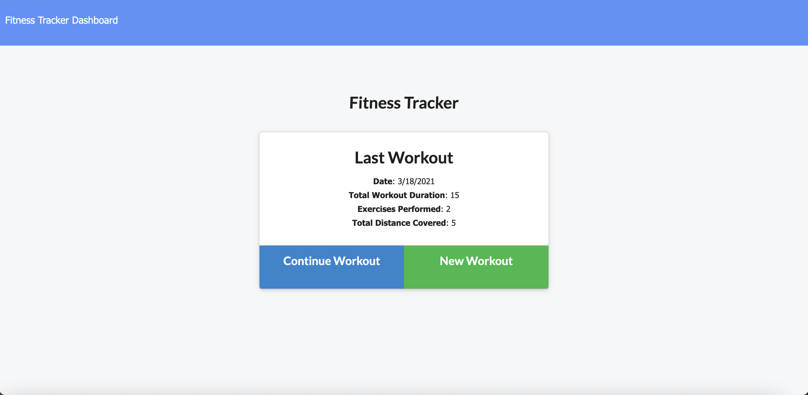
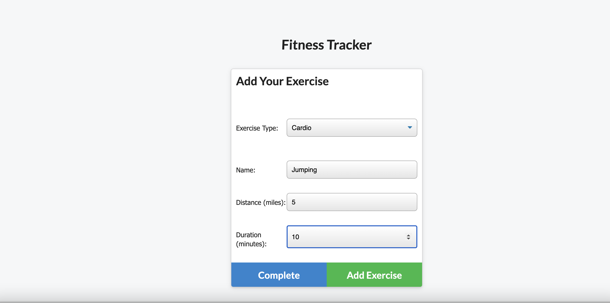
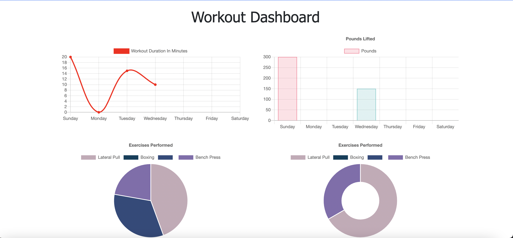

# workout-tracker1

  An application that allows users to view, create and track daily workouts. Also, it allows them to log multiple exercises in a workout on a given day and be able to track the name, type, weight, sets, reps, and duration of the exercise. They will be able to visualize their progress through graphs as well.

## LINK TO THE REPOSITORY

-  [workout-tracker1](https://github.com/LShuqair/workout-tracker1)

## LINK TO Deployed App

-  [workout-tracker1](https://shielded-stream-87737.herokuapp.com/?id=6055fa93b1043500158d8cf5)

## Screen-shot

